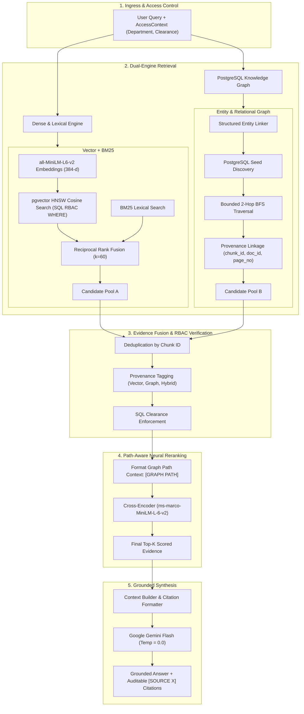

# Enterprise Graph RAG

[](https://www.python.org/)
[](https://github.com/pgvector/pgvector)
[](https://fastapi.tiangolo.com/)
[](ui/)
[](docker-compose.yml)
[](LICENSE)

A production-grade, dual-engine **Enterprise Hybrid Graph RAG** platform engineered natively inside PostgreSQL. Combines **Dense Vector Search (`pgvector`)**, **Okapi BM25 Lexical Search**, **Reciprocal Rank Fusion (RRF)**, **Path-Aware Cross-Encoder Reranking**, and an in-database **Knowledge Graph** with verifiable citation provenance and multi-tenant Role-Based Access Control (RBAC).

Built from first principles in pure Python without external graph database lock-in (no Neo4j required) or black-box agentic wrappers.

---

## Architecture Overview



---

## Core Engineering Features

### 1. Dual-Engine Retrieval (Vector + BM25 + Graph)
* **Dense Semantic Search:** 384-dimensional dense vectors generated via `all-MiniLM-L6-v2` and indexed using PostgreSQL `pgvector` HNSW index with cosine distance (`vector_cosine_ops`).
* **Lexical BM25:** Inverted index with tunable term frequency saturation ($k_1=1.5$) and document length normalization ($b=0.75$).
* **Reciprocal Rank Fusion (RRF):** Merges dense and sparse rankings using $RRF(d) = \sum \frac{1}{k + \text{rank}(d)}$.
* **PostgreSQL Knowledge Graph:** Entity-relationship triples stored directly in PostgreSQL (`entities`, `relationships`) with recursive CTE / BFS traversal to resolve multi-hop connections that vector similarity misses.

### 2. Path-Aware Cross-Encoder Reranking
* Standard neural rerankers score raw text snippets, frequently penalizing graph-derived evidence due to surface vocabulary differences.
* Our reranker dynamically injects verified knowledge graph relationship paths into the cross-attention prompt:
  ```
  [GRAPH PATH]
  Atlas --[USES]--> Payment Service
  Payment Service --[DEVELOPED_BY]--> Platform Engineering

  [DOCUMENT CONTENT]
  The platform engineering squad maintains the payment service microservice...
  ```
* Rescores candidate pools using `cross-encoder/ms-marco-MiniLM-L-6-v2` to deliver the most authoritative passages into generation context.

### 3. Multi-Tenant Role-Based Access Control (RBAC)
* Documents are tagged by **Department** (`public`, `engineering`, `finance`, `hr`), **Clearance Level** (`public`, `employee`, `manager`, `admin`), and lifecycle **Status** (`active` vs `archived`).
* **SQL-Level Enforcement:** Predicates are enforced directly in PostgreSQL queries (`WHERE department = :dept AND access_level <= :clearance AND status = 'active'`).
* **Zero Leakage:** Unauthorized chunks are mathematically filtered at the database level and never reach the reranker or LLM context.

### 4. Grounded Synthesis & Auditable Citations
* Strict zero-hallucination guardrails: If evidence is absent or insufficient, the LLM deterministically refuses rather than inventing facts.
* In-text citations link directly to verified source documents, chunk IDs, and page numbers.

---

## Technology Stack

| Layer | Technology | Description |
| :--- | :--- | :--- |
| **Language** | Python 3.11+ | Modern type annotations, async handlers, Pydantic v2 schemas |
| **Database** | PostgreSQL 16 + `pgvector` | Unified relational, vector (HNSW), and graph store |
| **Dense Embeddings** | `sentence-transformers/all-MiniLM-L6-v2` | Lightweight 384-d vectors, 100% offline |
| **Lexical Search** | Okapi BM25 | Pure Python sparse lexical retrieval engine |
| **Reranker** | `cross-encoder/ms-marco-MiniLM-L-6-v2` | Deep cross-attention relevance scoring |
| **LLM Generation** | Google Gemini Flash | Low-latency grounded generation (temperature 0.0) |
| **REST API** | FastAPI + Uvicorn | Production REST API with OpenAPI Swagger UI |
| **Web UI** | Streamlit | Real-time interactive UI with provenance badges |
| **Containerization** | Docker & Docker Compose | Multi-container production deployment |

---

## Quickstart

### Prerequisites
* Python 3.11+
* Docker Desktop (for PostgreSQL + pgvector)
* Google Gemini API Key

### 1. Clone & Set Up Environment

```powershell
# Clone repository
git clone https://github.com/DhruvalPtl/Enterprise-Graph-RAG.git
cd Enterprise-Graph-RAG

# Create virtual environment
python -m venv .venv
.venv\Scripts\Activate.ps1    # On Windows PowerShell
# source .venv/bin/activate   # On Linux/macOS

# Install dependencies
pip install -r requirements.txt
```

### 2. Configure Environment Variables

Copy the example configuration:
```powershell
Copy-Item .env.example .env    # Windows PowerShell
# cp .env.example .env         # Linux/macOS
```

Ensure `.env` contains:
```env
GEMINI_API_KEY=your_gemini_api_key_here
POSTGRES_HOST=localhost
POSTGRES_PORT=5432
POSTGRES_DB=rag_db
POSTGRES_USER=postgres
POSTGRES_PASSWORD=postgres
```

### 3. Launch PostgreSQL (Docker)

```powershell
docker compose up -d postgres
```

Initialize database tables and HNSW vector indexes:
```powershell
python scripts/init_db.py
```

### 4. Start the Application

In terminal 1 (FastAPI Backend):
```powershell
uvicorn app.api.main:app --host 0.0.0.0 --port 8000 --reload
```
* Interactive Swagger API Docs: [http://localhost:8000/docs](http://localhost:8000/docs)
* Health endpoint: [http://localhost:8000/health](http://localhost:8000/health)

In terminal 2 (Streamlit UI):
```powershell
streamlit run ui/app.py --server.port 8501
```
* Open your browser at [http://localhost:8501](http://localhost:8501)

---

## Document Ingestion & Management

### Option A: Ingest via Streamlit Web UI
1. Open the UI at [http://localhost:8501](http://localhost:8501).
2. Expand **📄 Document Ingestion** in the sidebar.
3. Upload any `.pdf`, `.md`, or `.txt` file.
4. Set the document's Department and Clearance Level.
5. Click **Process & Index Document** to automatically chunk, embed, and index it into PostgreSQL.

### Option B: Batch CLI Ingestion
1. Place your `.pdf`, `.md`, or `.txt` files in `data/raw/`.
2. Run the ingestion commands:
```powershell
# 1. Structure-aware chunking
python run_pipeline.py

# 2. Compute 384-d MiniLM embeddings
python scripts/embed_chunks.py

# 3. Store in PostgreSQL + pgvector
python scripts/store_chunks_in_db.py

# 4. (Optional) Extract Knowledge Graph Triples
python scripts/run_graph_extraction_full.py
```

### Resetting to a Blank Slate
To wipe all documents, chunks, and graph tables to start completely fresh:
```powershell
python scripts/reset_db.py --yes --include-files
```

---

## REST API Reference

### Health Check
```http
GET /health
```
```json
{
  "status": "ok",
  "app": "Enterprise Knowledge Intelligence Platform API",
  "version": "1.0.0",
  "database": "connected"
}
```

### Query Endpoint
```http
POST /query
Content-Type: application/json
```
```json
{
  "query": "What are the document ingestion standards under the AI governance policy?",
  "top_k": 5,
  "candidate_k": 20,
  "access_context": {
    "department": "engineering",
    "access_level": "employee",
    "include_archived": false
  }
}
```

Response includes the grounded answer, source citations with exact page numbers, retrieval provenance badges (`HYBRID VERIFIED`, `GRAPH TRAVERSAL`, `DENSE / BM25`), and latency diagnostics.

---

## Testing

Run the automated test suite:
```powershell
pytest tests/
```

Tests validate end-to-end functionality including PDF loaders, structural chunking, vector indexing, BM25 scoring, graph traversal, Cross-Encoder reranking, SQL-level RBAC enforcement, and API schemas.

---

## License

This project is licensed under the MIT License — see the [LICENSE](LICENSE) file for details.
