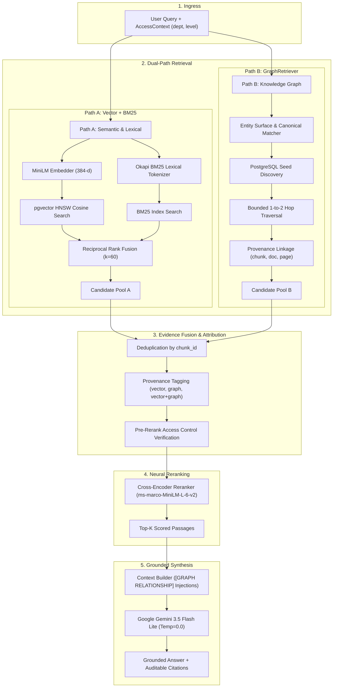

# Enterprise Knowledge Intelligence Platform (Hybrid RAG + Graph RAG)

[](https://www.python.org/downloads/)
[](https://github.com/pgvector/pgvector)
[](https://fastapi.tiangolo.com/)
[](ui/)
[](LICENSE)
[](tests/)

A production-grade, modular Enterprise Retrieval-Augmented Generation (RAG) platform combining **Dense Vector Search**, **BM25 Lexical Search**, **Reciprocal Rank Fusion (RRF)**, **Cross-Encoder Reranking**, and an in-database **PostgreSQL Knowledge Graph** with full provenance attribution and multi-tenant access control.

Built from first principles in pure Python without black-box agentic wrappers or framework abstractions, ensuring every layer is auditable, measurable, and debuggable.

---

## 1. Architectural Overview



---

## 2. Core Engineering Capabilities

### 1. Structure-Aware Document Ingestion & Chunking
- **Format Parsers**: Native PDF parsing via PyMuPDF (`fitz`) and PyPDF, preserving 1-indexed source page numbers, table boundaries, and section headers.
- **Recursive Structural Chunking**: Cuts along natural grammatical and semantic boundaries (headings, code blocks, lists, paragraphs) rather than blind character offsets.
- **Deterministic Hashing**: Chunks and documents receive idempotent SHA-256 identifiers to guarantee reproducible indexing.

### 2. Dual-Provider Vector Indexing & pgvector HNSW
- **Dense Vector Embeddings**: Primary 384-dimensional offline embeddings via `sentence-transformers/all-MiniLM-L6-v2`. Secondary support for Google Gemini `text-embedding-004` (768-d).
- **Dimension Safety**: Strict database column constraints (`VECTOR(384)`) and Python ingestion gates prevent accidental vector space mixing.
- **HNSW Acceleration**: PostgreSQL `hnsw (embedding vector_cosine_ops)` index delivers sub-millisecond approximate nearest neighbor search over thousands of chunks.

### 3. Hybrid Retrieval & Reciprocal Rank Fusion (RRF)
- Combines high-recall dense semantic search with Okapi BM25 keyword matching.
- Merges disparate score distributions uniformly using Reciprocal Rank Fusion ($RRF\_Score = \sum \frac{1}{k + rank}$).

### 4. Cross-Encoder Neural Reranking
- Reranks top-$k$ candidate passages against the query using `cross-encoder/ms-marco-MiniLM-L-6-v2`.
- Computes true token-level cross-attention between query and passage, eliminating false positives from bi-encoder retrieval.

### 5. PostgreSQL-Native Knowledge Graph & Bounded Traversal
- **Relational Graph Schema**: Explicit `entities` and `relationships` tables with full referential integrity and foreign keys.
- **Source Provenance**: Every directed relationship edge retains foreign key links to `document_id`, `chunk_id`, and `page_number`.
- **Bounded Traversal**: Parameterized graph walk ($depth \in \{1, 2\}$, $max\_seeds=10$, $max\_results=20$) prevents combinatorial graph explosion.
- **Dual-Model Interleaved Extraction**: Quota-optimized extraction engine alternating between `gemini-3.5-flash-lite` and `gemini-3.1-flash-lite` at up to 28.5 RPM.

### 6. Multi-Tenant Role-Based Access Control (RBAC)
- Multi-tier security filtering enforcing both **department** (`engineering`, `marketing`, `finance`, `public`) and **access level** (`public`, `employee`, `manager`, `admin`).
- Security boundaries are applied pre-retrieval in SQL WHERE clauses and verified during graph traversal and evidence fusion.

### 7. Grounded Generation & Hallucination Suppression
- Injected system prompts force strict grounding: the model may only assert facts backed by retrieved passages.
- Negative controls: Questions lacking evidence trigger a standard refusal rather than speculative generation.

---

## 3. Technology Stack

| Component | Technology | Selection Rationale |
| :--- | :--- | :--- |
| **Language** | Python 3.12 | Modern type hinting, performance, and library compatibility. |
| **Vector Database** | PostgreSQL 16 + pgvector | Unified transactional store for relational data, vectors, and graph edges. |
| **Dense Embeddings** | `all-MiniLM-L6-v2` | Fast, lightweight (384-d), runs 100% offline without API costs. |
| **Lexical Search** | Okapi BM25 | Native sparse lexical retrieval with customizable $k_1$ and $b$ tuning. |
| **Reranker** | `ms-marco-MiniLM-L-6-v2` | High cross-attention scoring accuracy with minimal CPU latency. |
| **LLM Synthesis** | Gemini 3.5 Flash Lite | Low-latency, grounded generation via official `google-genai` SDK. |
| **Web Framework** | FastAPI + Uvicorn | Async REST API with Pydantic v2 schemas and auto-generated OpenAPI docs. |
| **Containerization** | Docker & Docker Compose | Isolated multi-container environment with non-root security (`appuser`). |

---

## 4. Repository Structure

```
.
├── app/                              # Core Application Logic
│   ├── api/                          # FastAPI REST Application
│   │   ├── main.py                   # API routes, lifespan, and exception handlers
│   │   ├── schemas.py                # Pydantic request/response schemas
│   │   └── dependencies.py           # Dependency injection & pipeline caching
│   ├── evaluation/                   # G5 Benchmark & Evaluation Suite
│   │   ├── dataset.py                # Schema & loader for gold-standard dataset
│   │   ├── metrics.py                # Deterministic retrieval & graph metrics
│   │   ├── runner.py                 # Dual-system execution harness
│   │   └── reporting.py              # Markdown & JSON report formatters
│   ├── bm25.py                       # Okapi BM25 implementation
│   ├── chunker.py                    # Recursive structural chunking engine
│   ├── config.py                     # Centralized environment configuration
│   ├── context_builder.py            # Evidence formatting & graph provenance tags
│   ├── db.py                         # PostgreSQL connection pool & queries
│   ├── embeddings.py                 # SentenceTransformers & Gemini embedder facade
│   ├── graph_checkpoint.py           # Durable SQLite extraction tracker
│   ├── graph_extractor.py            # Dual-model interleaved extraction service
│   ├── graph_ontology.py             # 15 entity & 19 relationship ontology definitions
│   ├── graph_retriever.py            # Seed matching & bounded graph traversal
│   ├── hybrid.py                     # Vector + BM25 + RRF coordinator
│   ├── hybrid_retriever.py           # Graph + Vector hybrid retrieval & fusion
│   ├── key_pool.py                   # Multi-account API key rotation pool
│   ├── llm.py                        # Grounded Gemini generation provider
│   ├── loaders.py                    # PyMuPDF, PyPDF, Markdown, & Text loaders
│   ├── models.py                     # Core dataclasses and domain models
│   ├── rag.py                        # Top-level RAGPipeline coordinator
│   ├── reranker.py                   # Cross-Encoder neural reranker
│   ├── rrf.py                        # Reciprocal Rank Fusion implementation
│   └── vector_store.py               # pgvector cosine similarity search
├── data/                             # Corpora and Evaluation Data
│   ├── raw/                          # Active source documents (PDF, MD, TXT)
│   ├── processed/                    # Processed chunk and embedding JSONs
│   └── evaluation/                   # Gold-standard questions and traces
│       ├── graph_rag_eval.json       # 24 benchmark questions across 8 categories
│       └── results/                  # Detailed benchmark outputs and summaries
├── reports/                          # Audit & Empirical Evaluation Reports
│   ├── graph_rag_evaluation_report.md# G5 Head-to-Head Benchmark Report
│   ├── graph_extraction_full_report.md# G2.2 Extraction Metrics Report
│   ├── g6_project_audit.md           # G6 Inventory & Classification Audit
│   └── g6_verification_report.md     # G6 Verification & GitHub Readiness
├── scripts/                          # Operational & Verification Scripts
│   ├── ask_rag.py                    # Interactive CLI query tool
│   ├── demo_graph_hybrid_rag.py      # Dual-path hybrid walkthrough script
│   ├── evaluate_graph_rag.py         # Automated G5 evaluation benchmark runner
│   ├── init_db.py                    # Database schema and index initialization
│   ├── run_graph_extraction_full.py  # Production corpus graph extraction runner
│   ├── test_rag_regressions.py       # Live pipeline regression test suite
│   └── verify_api.py                 # FastAPI testclient verification script
├── tests/                            # Comprehensive Test Suite (228 tests)
├── .dockerignore                     # Docker build exclusion rules
├── .env.example                      # Template environment variable configuration
├── .gitignore                        # Git exclusion rules
├── docker-compose.yml                # Multi-container Docker Compose definition
├── Dockerfile                        # Production-hardened container build
└── requirements.txt                  # Pinned Python dependencies
```

---

## 5. Getting Started

### Prerequisites
- Python 3.12+
- PostgreSQL 16 with `pgvector` extension (or Docker)
- Google Gemini API key (optional for local vector search, required for LLM generation)

### Option A: Local Development Setup

1. **Clone the repository and create a virtual environment**:
   ```bash
   git clone https://github.com/your-username/enterprise-rag.git
   cd enterprise-rag
   python -m venv .venv
   .\.venv\Scripts\activate        # Windows
   # source .venv/bin/activate     # Linux / macOS
   ```

2. **Install dependencies**:
   ```bash
   pip install --upgrade pip
   pip install -r requirements.txt
   ```

3. **Configure environment variables**:
   ```bash
   cp .env.example .env            # Linux/macOS
   Copy-Item .env.example .env     # Windows PowerShell
   ```
   Edit `.env` to configure your `DATABASE_PASSWORD` and `GEMINI_API_KEY`.

4. **Initialize database schema**:
   ```bash
   python scripts/init_db.py
   ```

5. **Start the FastAPI server**:
   ```bash
   uvicorn app.api.main:app --host 0.0.0.0 --port 8000 --reload
   ```

6. **Start the Interactive Streamlit UI**:
   ```bash
   streamlit run ui/app.py --server.port 8501
   ```
   Access the web application at [http://localhost:8501](http://localhost:8501) with live dual-engine toggles, provenance badges, and graph traversal visualization.

### Option B: Docker Compose Deployment

Launch both PostgreSQL (with pgvector) and the FastAPI backend with a single command:
```bash
docker compose up -d --build
```
Verify container health:
```bash
docker compose ps
curl http://localhost:8000/health
```

Interactive OpenAPI Swagger UI is accessible at: `http://localhost:8000/docs`

---

## 6. Verification & Test Suite

The repository features 232 automated unit, integration, and regression tests.

```bash
# Run the complete test suite
python -m pytest -v

# Run targeted RAG pipeline regressions
python scripts/test_rag_regressions.py

# Run Graph + Vector hybrid retrieval demonstration
python scripts/demo_graph_hybrid_rag.py

# Verify FastAPI REST endpoints
python scripts/verify_api.py
```

---

## 7. Empirical Evaluation & Benchmarking (Phase G5)

To measure the real-world utility of Graph RAG versus Vector RAG without manufactured assumptions, the pipeline was evaluated on **24 gold-standard questions** across 8 distinct archetypes using the production corpus (Stanford AI Index 2024 & Jurafsky & Martin NLP).

```bash
python scripts/evaluate_graph_rag.py --candidate-k 10 --top-k 3
```

### Head-to-Head Results

| Metric | Vector-Only Baseline | Hybrid Graph + Vector | Delta / Graph Impact |
| :--- | :--- | :--- | :--- |
| **Recall@1** | 0.2722 | 0.2722 | +0.0000 |
| **Recall@3** | 0.4542 | 0.4542 | +0.0000 |
| **Recall@5** | 0.4542 | 0.4542 | +0.0000 |
| **HitRate@3** | 0.5417 | 0.5417 | +0.0000 |
| **MRR (Mean Reciprocal Rank)** | 0.4722 | 0.4722 | +0.0000 |
| **Citation Correctness** | 0.0833 | 0.0833 | +0.0000 |
| **Citation Completeness** | 0.0833 | 0.0833 | +0.0000 |
| **Answer Correctness** | 0.2750 | 0.2750 | +0.0000 |
| **Groundedness Score** | 0.9167 | 0.9167 | +0.0000 |
| **Avg Retrieval Latency** | **559.7 ms** | **763.4 ms** | **+211.8 ms overhead** |
| **Overall Verdicts** | **Hybrid Won: 2** | **Vector Won: 0** | **Tie: 22** |

### Knowledge Graph Telemetry
- **Seed Entity Hit Rate**: **70.8%** (17 of 24 queries successfully matched knowledge graph seed entities).
- **Graph Provenance Coverage**: **31.2%** of gold-standard chunks were directly covered by traversed relationship edge provenance.
- **Candidate Overlap (Jaccard)**: **4.2%** — Graph retrieval retrieves candidates that are 95.8% distinct from Vector/BM25, proving it functions as an orthogonal evidence channel.
- **Unique Relevant Chunks Added**: **3 chunks** were retrieved **only** by Graph and missed by Vector/BM25.

### Empirical Conclusions: Where Graph RAG Helps vs Where It Doesn't
1. **Multi-Hop Relational Queries**: When queries connect disparate concepts (e.g. *Query q008: "What organization developed Gemini Ultra and what benchmark was it evaluated on?"*), knowledge graph edges bridged the vocabulary gap to pull in chunks `41107` and `41135` that vector search missed.
2. **Dense Topical Queries**: For single-topic queries with rich vocabulary, dense vector search and BM25 already retrieve the exact chunk at Rank #1. Graph retrieval adds minimal lift.
3. **Latency Cost**: Graph retrieval adds an average overhead of **+211.8 ms**, dominated by SQL joins and graph candidate deduplication.

---

## 8. API Specification

### `GET /health`
Returns system liveness and database connection status.
```json
{
  "status": "ok",
  "app": "Enterprise Knowledge Intelligence Platform API",
  "version": "1.0.0",
  "database": "connected"
}
```

### `POST /query`
Performs end-to-end question answering with metadata-aware retrieval and citation synthesis.

**Request**:
```json
{
  "query": "What organization developed Gemini Ultra and what benchmark was it evaluated on?",
  "candidate_k": 20,
  "top_k": 3,
  "temperature": 0.0,
  "access_context": {
    "department": "public",
    "access_level": "public"
  }
}
```

**Response**:
```json
{
  "query": "What organization developed Gemini Ultra and what benchmark was it evaluated on?",
  "answer": "Gemini Ultra was developed by Google [SOURCE 3]. It was evaluated on the Massive Multitask Language Understanding (MMLU) benchmark [SOURCE 1, SOURCE 3].",
  "citations": [
    {
      "source_id": 1,
      "chunk_id": 41417,
      "document_id": "91",
      "filename": "Artificial-Intelligence-Index-Report-2024-Stanford-University.pdf",
      "page_number": 87,
      "reranker_score": 5.0039,
      "formatted": "[SOURCE 1] Artificial-Intelligence-Index-Report-2024-Stanford-University.pdf (Page 87)"
    }
  ],
  "model_name": "gemini-3.5-flash-lite",
  "diagnostics": {
    "retrieval_mode": "hybrid_graph_vector",
    "candidate_count": 28,
    "vector_candidate_count": 20,
    "graph_candidate_count": 12,
    "graph_seed_count": 3,
    "graph_relationship_count": 20
  }
}
```

---

## 9. License

This project is licensed under the MIT License — see the [LICENSE](LICENSE) file for details.
